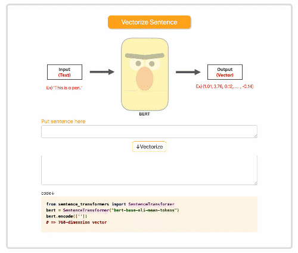
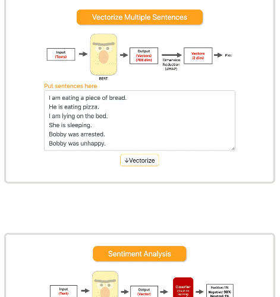
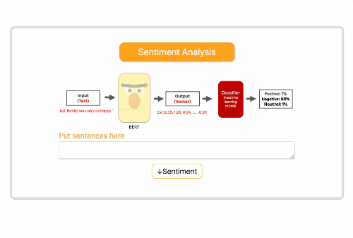
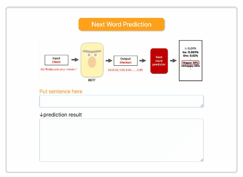

# bert_demo_app

Demo app to show how to use BERT😁.

## Usage

```bash
pipenv install --dev --skip-lock
pipenv run python app.py
```

## Features

## Text Vectorization

<p align="center">
  
</p>

## Text Clustering

<p align="center">
  
</p>

## Sentiment Analysis

<p align="center">
  
</p>

## Next Word Prediction

<p align="center">
  
</p>
